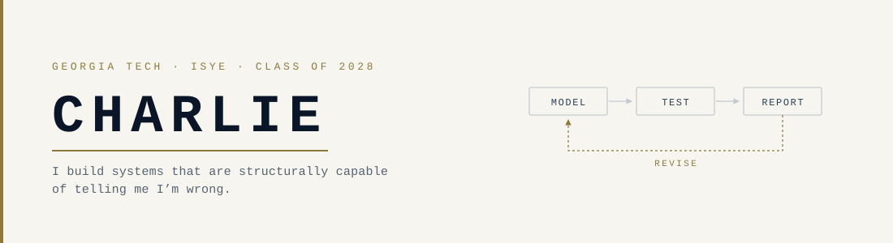

<picture>
  <source media="(prefers-color-scheme: dark)" srcset="assets/banner-dark.svg">
  
</picture>

### Hey, I'm Charlie

I'm an Industrial &amp; Systems Engineering student at Georgia Tech, and most of what I
build lives where operations research meets money — optimization, simulation, and
statistics pointed at decisions that actually cost something if you get them wrong.

The habit that shows up in all of it: I decide what "working" means *before* I run the
test, then report the result against that bar. Sometimes the answer is that my idea
doesn't work. Those results are in my repos too — they're the ones I learned the most
from.

Right now I'm a **Global Innovation Intern at Americold**, working on cold-chain
logistics and warehouse throughput. Outside of that I run a systematic trading system
I've been building and breaking for a while, and I'm slowly getting the parts of it that
are safe to share out into the open.

**Looking for:** summer 2027 internships in quant research, quant dev, or data science.

---

### What I work with

**Core**
&nbsp;

**Modeling**
&nbsp;

**Engineering**
&nbsp;

---

### Selected work

**[Realistic Backtesting Engine](https://github.com/thirdbrew/Back-Testing-Engine)** &nbsp;·&nbsp; `Python` `pandas` `NumPy`

A bar-by-bar equity backtester built so lookahead bias is impossible by construction
rather than by remembering to avoid it. One place in the engine turns a decision into a
fill, and it can only act on the previous bar's target. Every fill pays half-spread,
slippage, and commission, all applied against the trader — the honest direction.

I used it on a naive EMA(5/8) crossover. It returned **+6.7% over five years against
+134% for buy-and-hold**, with a worse drawdown and a mean daily return you can't
distinguish from zero. That's the result, and documenting it cleanly was the point.

**Systematic Portfolio Engine** &nbsp;·&nbsp; *private* &nbsp;·&nbsp; `Python` `pandas` `SciPy`

Monthly-rebalanced allocation system with cost-aware sizing, per-position stops, and a
decision journal I write *before* each trade so the reasoning is still gradeable after I
know the outcome. Limits, floors, and stops live in one config file instead of scattered
through the code.

Four improvements I was convinced would work got rejected after failing pre-registered
out-of-sample tests. I kept the write-ups.

---

Performance figures are backtest output over a stated window, net of stated costs.
The assumptions are written down — ask me for them.

📫 &nbsp;[charlesbmay3@gmail.com](mailto:charlesbmay3@gmail.com)
